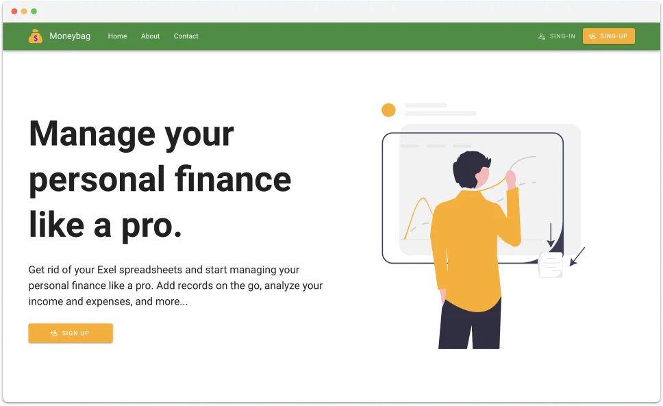
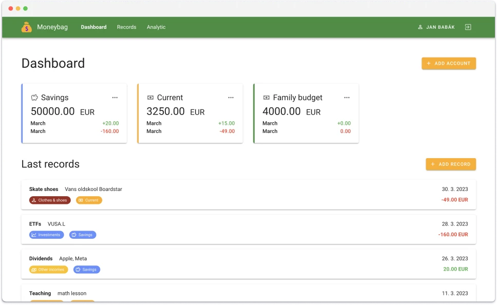
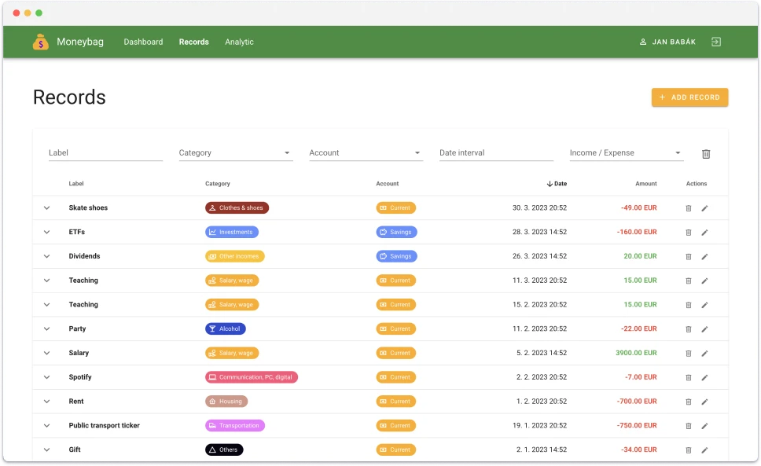
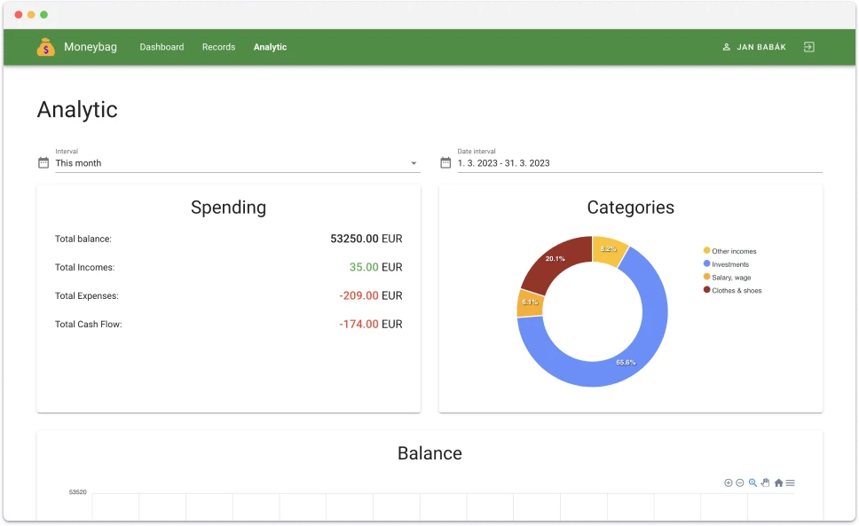

# Moneybag - Backend

[](https://www.java.com/en/)
[](https://spring.io)
[](https://maven.apache.org)
[](https://www.mysql.com)
[](https://swagger.io)
[](https://www.postman.com)

## 📝 Description

Moneybag is a **web application** used to manage **personal finance**. Users can have several accounts. They can create and categorize their records and then analyze their income and expenses.

The application consists of a **separate backend and frontend**, which are connected via a **REST API**. The backend is written in Java using the Spring framework and uses a MySql database for data persistence. The frontend is a **single-page application** written in TypeScript and the Vue.js and Vuetify frameworks.

## 🔗 Links

- [📺 Video example](https://www.youtube.com/watch?v=rzZ-Xvy9iwY)
- [💅 Frontend repo](https://github.com/janbabak/Moneybag-FE)
- [📯 API documentation (Post man)](https://documenter.getpostman.com/view/131905572s93CRKWwv#b9ffcedf-337f-4546-8095-5740e9047e96)
- [📄 API documentation (Swagger)](https://janbabak.github.io/Moneybag-BE/)


## ⚽️ Project Goals

There were several reasons why I created this project. First of all, I wanted to try different technologies. Secondly, I wanted to try all stages of a software development cycle. And I also wanted to add some work to my portfolio, which can showcase my development skills.

## 🏗️ Realization

First, I created a list of all the requirements, chose the necessary technologies, and then started developing the backend server.

I developed the backend in Java and Spring framework and chose the MySql database for data persistence. The application utilizes the MVC architecture. The database runs in a Docker container. Authentication and authorization are provided by JWT token using Spring Security. The API automatically generates [Open Api](https://janbabak.github.io/Moneybag-BE/) documentation. I also created the API [documentation](https://documenter.getpostman.com/view/13190557/2s93CRKWwv#b9ffcedf-337f-4546-8095-5740e9047e96) with example requests and responses using Postman.

## 🚀 Features

- Multiple financial accounts
- Add records and categorize them
- Analytic of categories, incomes, expenses, cash flow...
- Charts
- Responsive web interface

## ❌ Issues

I had to face a few issues during the development. For example, I wanted to add filtering and sorting parameters to the "get all records" endpoint. I solved this issue by using the specification-arg-resolver library, which can map request parameters to Jpa specifications, and by extending the record repository by PagingAndSortingRepository, and JpaSpecificationExecutor.

## 😁 Conclusion

I originally planned to create a much smaller project but finished with a larger one. I **gained new knowledge** during development - for instance, how to elegantly add **filtering parameters** to the API endpoint or use **JPQL** for more complex database queries. So, I am satisfied with the result of my work.


## ✅ Software requirements
- Java 17
- Docker, Docker compose

## 🎬 How to run

### Clone repository

```bash
git clone https://github.com/babakjan/Moneybag-BE.git
cd Moneybag-BE/
```

### Start database

```bash
docker compose up -d
```

### Start the app

- Create database schema - open `./src/main/resources/application.properties` find the following lines and (un)comment them
  to look like this:
    ```
    #spring.jpa.hibernate.ddl-auto=none
    spring.jpa.hibernate.ddl-auto=create
    ```
- Run the app (app will run on http://localhost:8000/api)
    ```bash
    ./mvnw spring-boot:run
    ```
- If you want to initiate the database with test data, stop the app and undo the changes you've done in the application
  properties file,
  plus make sure, that the following line is uncommented
  ```
  spring.sql.init.mode=always
  ```
- run the app again
    ```bash
    ./mvnw spring-boot:run
    ```
- If you want to run the app repeatedly, comment the previously uncommented line because you don't want to insert test data
  every time you restart the app.

- Swagger documentation of running app can be found at http://localhost:8000/api/swagger-ui/index.html

## 🎆 Screenshots





