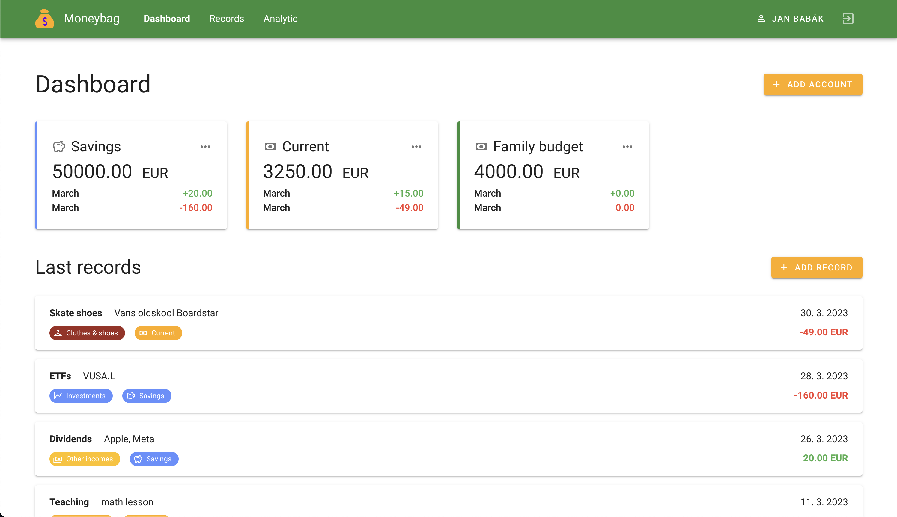
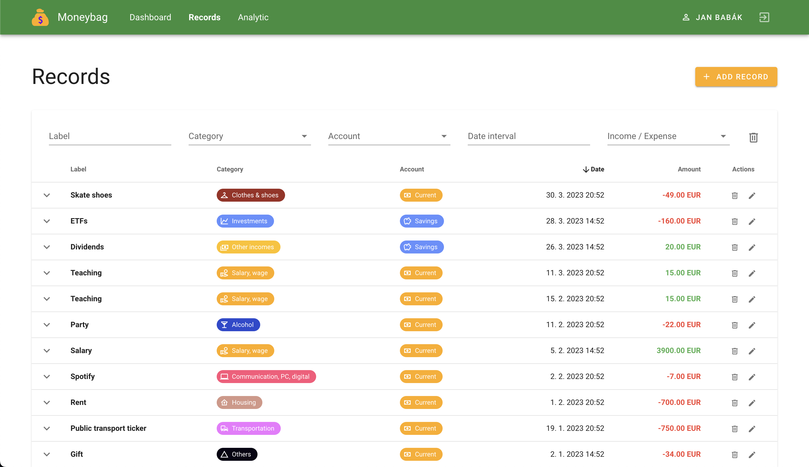
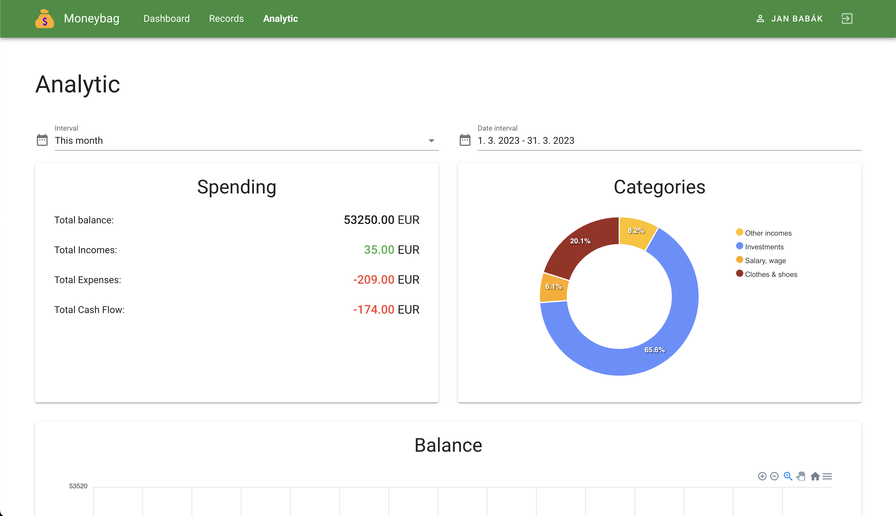

# 💰 Moneybag - Backend

Moneybag is a web **app for personal finance management**. Get rid of your Exel
spreadsheets and start managing your personal finance like a pro. Add records
on the go, analyze your income and expenses, and more.

## 📝 Description

This repository contains source codes of the backend server of the Moneybag application. There were several reasons, why I created this project. First of all, I wanted to try different technologies, secondly, I wanted to try all stages of a software development cycle. And I also wanted to add some work to my portfolio, which can showcase my development skills.

## 🚀 Features

- Multiple financial accounts
- Add records and categorize them
- Analytic of categories, incomes, expenses, cash flow...
- Charts
- Responsive web interface

## 🧑‍🔬 Technologies

- Java
- Spring Boot
- Spring Security
- MySQL
- Docker compose
- Maven
- git

## 🔗 Links

- [Frontend repository](https://github.com/babakjan/Moneybag-FE)
- [API documentation (Post man)](https://documenter.getpostman.com/view/13190557/2s93CRKWwv#b9ffcedf-337f-4546-8095-5740e9047e96)
- [API documentation (Swagger)](https://babakjan.github.io/Moneybag-BE/)

## 🎬 How to run

### Clone repository

```bash
git clone https://github.com/babakjan/Moneybag-BE.git
cd Moneybag-BE/
```

### Start database

```bash
docker compose up -d
```

### Start the app

- Create database schema - open `./src/main/resources/application.properties` find the following lines and (un)comment them
  to look like this:
    ```
    #spring.jpa.hibernate.ddl-auto=none
    spring.jpa.hibernate.ddl-auto=create
    ```
- Run the app
    ```bash
    ./mvnw spring-boot:run
    ```
- If you want to initiate the database with test data, stop the app and undo the changes you've done in the application
  properties file,
  plus make sure, that the following line is uncommented
  ```
  spring.sql.init.mode=always
  ```
- run the app again
    ```bash
    ./mvnw spring-boot:run
    ```
- If you want to run the app repeatedly, comment the previously uncommented line because you don't want to insert test data
  every time you restart the app.

## 🖼️ Frontend examples






